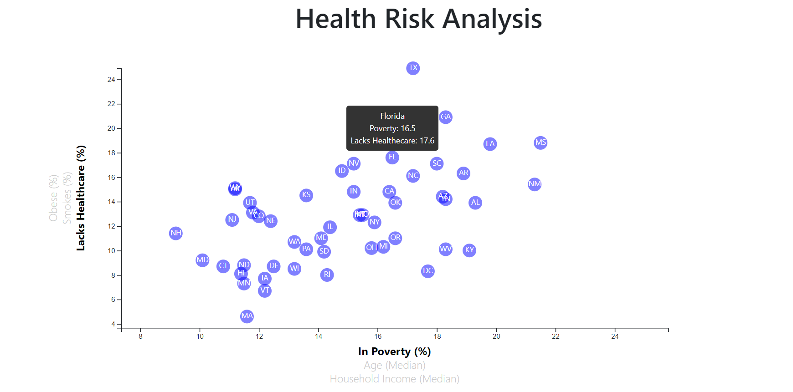

# D3-Challenge
This project contains an analysis of the current trends shaping people's lives, as well as creating charts, and interactive elements to help readers understand the findings. A scatter plot is created to analyse the following data.
<ul>
<li>Poverty %</li>
<li>Age</li>
<li>Household Income</li>
<li>Obesity</li>
<li>Smokes</li>
<li>Healthcare</li>
</ul>

Scatter plot contains circles with the abrreviation for each state it represents. A tooltip appears with the corresponding data during mouse over of the circle. Reader can select the data they want to see in both axes. A sample plot looks as following.

